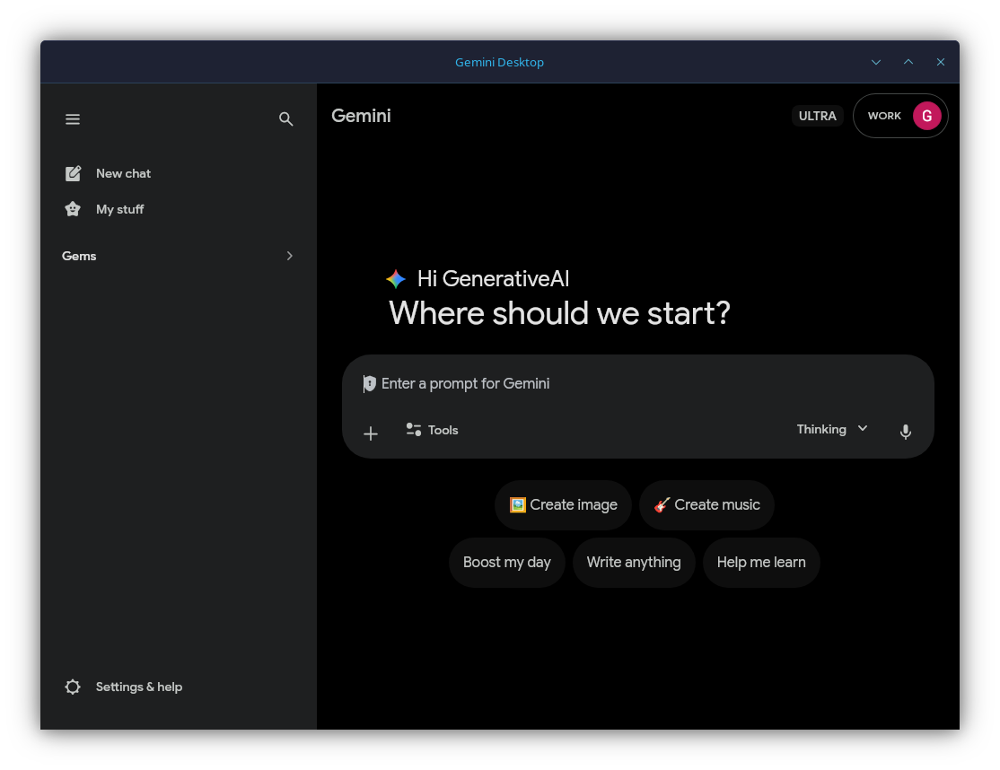

# Gemini Desktop for Linux (Unofficial)

An **unofficial Linux desktop wrapper** for Google Gemini, built as a lightweight desktop app that loads the official Gemini website using Rust and Tauri.




> **Disclaimer:**
> This project is **not affiliated with, endorsed by, or sponsored by Google**.
> "Gemini" is a trademark of **Google LLC**.
> This app does not modify, scrape, or redistribute Gemini content — it simply loads the official website.

---

## Features

### Floating Chat Bar
- **Quick Access Panel** - A frameless, floating window that stays on top of all apps for quick interactions.

### Global Keyboard Shortcut
- **Toggle Chat Bar** - Instantly show/hide the chat bar from any app using the global shortcut `Ctrl + Space`.

### Other Features
- Native Linux desktop experience (supports X11 and Wayland)
- Lightweight WebKit2GTK wrapper via Tauri
- Adjustable text size (Use `Ctrl + =`, `Ctrl + -`, and `Ctrl + 0` to adjust zoom)
- Uses the official Gemini web interface
- No tracking, no data collection
- Open source

---

## What This App Is (and Isn't)

**This app is:**
- A thin desktop wrapper around `https://gemini.google.com`
- A convenience app for Linux users

**This app is NOT:**
- An official Gemini client
- A replacement for Google's website
- A modified or enhanced version of Gemini
- A Google-authored product

All functionality is provided entirely by the Gemini web app itself.

---

## Login & Security Notes

- Authentication is handled by Google on their website
- This app does **not** intercept credentials
- No user data is stored or transmitted by this app

> Note: Google may restrict or change login behavior for embedded browsers at any time.

---

## System Requirements

- **Linux** (Tested on Arch Linux and Ubuntu)
- **Wayland/X11** Support
- `webkit2gtk-4.1`

---

## Installation

### Download
- Grab the latest AppImage, DEB, or RPM from the **[Releases](../../releases)** page.
  *(or build from source below)*

### Build from Source

Install the required build dependencies (Ubuntu/Debian):
```bash
sudo apt-get install libwebkit2gtk-4.1-dev build-essential curl wget file libssl-dev libgtk-3-dev libayatana-appindicator3-dev librsvg2-dev
```

(Arch Linux):
```bash
sudo pacman -S base-devel curl wget pnpm rustup webkit2gtk-4.1
rustup default stable
```

Clone and Build:
```bash
git clone https://github.com/bt7274/gemini-desktop-linux.git
cd gemini-desktop-linux
npm install
npm run tauri build
```
The executable will be located in `src-tauri/target/release/gemini-desktop-linux`.

*Note: If you encounter a `failed to run linuxdeploy` error during the AppImage bundling process on Linux, you can bypass it by running:*
```bash
APPIMAGE_EXTRACT_AND_RUN=1 NO_STRIP=true npm run tauri build
```
